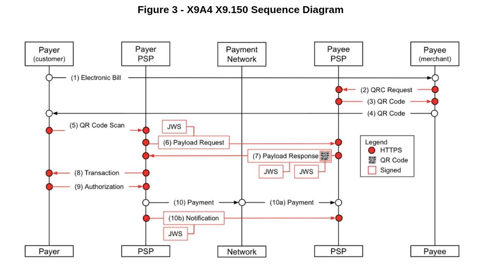

X9 QRCode Backend
========================

This application is a backend implementation of the **ANSI X9.150-2026 Payment QR Code Standard** — it generates and manages merchant-presented payment QR codes across US bank rails (RTP, FedNow, ACH) and public blockchains, and is currency-agnostic (any ISO 4217 code or digital-asset ticker is carried through as-is).

The X9.150 standard itself is copyrighted by ASC X9 and is **not** distributed with this repository. To obtain it, purchase it from the [ANSI Web Store](https://webstore.ansi.org/standards/ascx9/ansix91502026). See [`official-spec/README.md`](official-spec/README.md) for details.

The code is written in **Java 25** on **Spring Boot 3.5.x** and follows the Clean / Hexagonal Architecture pattern.

It runs as a container via Docker Compose, directly on the JVM, or on Kubernetes via the included Helm chart — see [RUNNING.md](RUNNING.md).

The application needs a MongoDB database to store the QR codes and their associated data.

The REST APIs are documented in the OpenAPI (Swagger) contract:

- [Official APIs](x9-qrcode-infrastructure/src/main/resources/apis/openapi.yaml)

**Provided AS IS.** This software is offered without warranty of any kind. It is source-available under the [Matera Source License v1.0](LICENSE.md) and **may be used and run under the terms of that license** — see [LICENSE.md](LICENSE.md) for the permitted uses and conditions.

# Contributing & Security

Contributions go through pull requests — `main` is protected and every PR needs review. Commits must
be DCO signed off (`git commit -s`); see [CONTRIBUTING.md](CONTRIBUTING.md).

Found a vulnerability? Report it **privately** — see [SECURITY.md](SECURITY.md), not a public issue.

# Project Structure

Maven multi-module project following Clean / Hexagonal architecture:

```
x9-qrcode/
├── x9-qrcode-build-init/      # Build bootstrap: installs vendored libs (others/libs), OpenAPI codegen
├── x9-qrcode-domain/          # Entities, Value Objects, domain services — pure Java, NO Spring
├── x9-qrcode-application/     # Use cases, DTOs, port interfaces, mappers — depends only on domain
├── x9-qrcode-infrastructure/  # Spring Boot app: REST controllers, MongoDB, JWS, configuration
├── secrets/                   # Local secrets & real keystores — GIT-IGNORED (only samples committed)
├── official-spec/             # ANSI X9.150-2026 reference notes (the copyrighted standard — PDF & Markdown — is git-ignored)
└── others/                    # helm/ (K8s charts) · scripts/ (k6, cert gen) · libs/ (vendored jars) · doc/
```

Inside each Java module:

| Path | Contents |
|------|----------|
| `src/main/java` | Production code (package `com.matera.x9qrcode`) |
| `src/main/resources` | `application*.yml`, the OpenAPI spec (`apis/openapi.yaml`), the self-signed sample keystore, DB changelog |
| `src/test/java` | **Unit tests** (domain/application, pure Java) and **integration tests** (`@IntegrationTest`, `@DatabaseTest` with Testcontainers) |
| `src/test/resources` | Test config (`application-test.yml`), and request/response **fixtures** & payloads used by the API-flow tests |

# Running the Application

The app requires a **MongoDB with a replica set** (needed for multi-document transactions). It
ships with a self-signed sample keystore so it runs out of the box; provide real X9-issued keys
via the git-ignored `secrets/` folder to sign with your own certificates (see [`secrets/README.md`](secrets/README.md)).

> **First time here?** See **[RUNNING.md](RUNNING.md)** for a step-by-step first-run guide
> (prerequisites, host-JVM vs Docker, building the image, and a `make help` of shortcuts).

There are three ways to run it:

1. **Standalone (JVM)** — build and run the Spring Boot app directly:
   ```bash
   mvn clean install
   mvn -pl x9-qrcode-infrastructure spring-boot:run
   ```

2. **Docker Compose** — self-contained (app + a single-node MongoDB replica set):
   ```bash
   docker compose up -d                               # bundled sample keystore
   docker compose -f docker-compose.prod.yml up -d    # your own secrets (mounts secrets/)
   ```

3. **Kubernetes** — via the Helm chart under `others/helm/x9-qrcode/`. Keep `replicaCount: 1`
   (see [High Availability](HIGH-AVAILABILITY.md) for the single-active-instance posture).

## Pull the prebuilt image (Docker Hub)

A multi-architecture image (**linux/amd64 + linux/arm64**) is published on Docker Hub at
[`materainc/x9-qrcode`](https://hub.docker.com/r/materainc/x9-qrcode):

```bash
docker pull materainc/x9-qrcode:latest          # newest build — auto-selects your architecture
docker pull materainc/x9-qrcode:git-<short-sha> # a specific commit (immutable), e.g. git-da5450e
```

Tags: `latest` (multi-arch, floating), `git-<short-sha>` (immutable, pinned to a source commit), and
the per-arch `latest-arm64` / `latest-amd64`.

Each image records the exact source commit it was built from, via standard OCI labels — so you can
always tell which version you're running (and that anything committed after it is *not* in the image):

```bash
docker inspect --format '{{index .Config.Labels "org.opencontainers.image.revision"}}' materainc/x9-qrcode:latest
# -> the full git SHA on https://github.com/matera-inc/x9.150-qrcode
```

The image is the application only; it still needs a **MongoDB replica set**. The quickest way to run
it with a bundled Mongo is Docker Compose (above); to run the pulled image against your own database,
point it there with the `SPRING_DATA_MONGODB_*` environment variables — see [RUNNING.md](RUNNING.md).

## MongoDB dependency

MongoDB Community is free to run in Docker. The compose files use the official **`mongo`** image
started as a **single-node replica set** (`mongod --replSet`) — the minimum required for the
transactions this app uses. For local testing, **`mongo:latest`** works out of the box (a 1-node
replica set initialized with `rs.initiate`), which is exactly what `docker-compose*.yml` set up.

# Configuration

To configure the application, use the Helm chart values files (`values-minimal.yaml` for quick start and `values.yaml` for full configuration).

- [Values minimal / template](others/helm/x9-qrcode/chart/values-minimal.yaml)
- [Values full](others/helm/x9-qrcode/chart/values.yaml)

For more details about Helm installing and upgrading, please refer to the README file in the Helm chart folder.

- [Helm deploy](others/helm/x9-qrcode/README.md)

For high availability (MongoDB replica sets and application failover) and how it relates to the license terms, see:

- [High Availability](HIGH-AVAILABILITY.md)

This service exposes an open, unauthenticated API. Access control is intentionally out of scope — protect it at your edge (API gateway, mTLS, or network policy).

We have a PostMan collection to facilitate the testing of the APIs.

- [PostMan collection](others/postman/postman_collection.json)

# Design & Planning Documents

Architecture, standard-alignment, and integration design notes:

- [Running & Testing](RUNNING.md) — first-run guide: prerequisites, host-JVM vs Docker, building the image, smoke test
- [Endpoints & Local Scan Testing](ENDPOINTS.md) — public/management endpoints, the single-origin URL model, and Cloudflare-tunnel setup for phone-scan testing
- [QR Code State Machine](STATE-MACHINE.md) — lifecycle states, transitions, and blockchain pre/post-commit
- [High Availability](HIGH-AVAILABILITY.md) — MongoDB replica sets, application failover, and license limits
- [Plan: Non-USD-Pegged Currencies](PLAN-NON-USD-PEGGED-CURRENCIES.md) — request-time FX and per-currency `validUntil` *(proposed)*

> Documents marked *proposed* describe designs that are not yet implemented.

# Performance Testing (k6)

A [k6](https://k6.io/) load test script is available for stress-testing the QR Code creation endpoint (`POST /api/v1/payment-request`).

- [k6 Load Test Script](others/scripts/k6/create-qrcodes-load-test.js)

## Test Profile

| Stage | Duration | Virtual Users |
|-------|----------|---------------|
| Ramp-up | 30s | 0 → 50 |
| Ramp to peak | 30s | 50 → 200 |
| Ramp to peak | 30s | 200 → 500 |
| **Sustain** | **3m** | **500** |
| Ramp-down | 30s | 500 → 0 |

## Thresholds

- **P95 latency** < 2 seconds
- **Success rate** > 95%
- **HTTP error rate** < 5%

## Running the Test

```bash
# Default (localhost:8080, open unauthenticated API, with dashboard)
k6 run --out web-dashboard others/scripts/k6/create-qrcodes-load-test.js --linger

# With custom environment variables (e.g., for prefix)
REPORT_PREFIX=mycustomprefix k6 run --out web-dashboard others/scripts/k6/create-qrcodes-load-test.js

# Custom target URL
k6 run --out web-dashboard -e BASE_URL="http://192.168.1.10:8080" others/scripts/k6/create-qrcodes-load-test.js --linger
```

Results are saved at `others/scripts/k6/results/` with timestamped filenames: `summary-YYYY-MM-DDTHH-mm-ss.json` and `summary-YYYY-MM-DDTHH-mm-ss.html`.


# JWS Signature implementation

The section below provides detailed information about the JSON Web Signature (JWS) implementation used in this standard to ensure the integrity and authenticity of messages exchanged between parties.

## Security Overview (JWS)

An X9.150 payment QR Code is **designed to be scanned by an authenticated payment application — not by a phone's camera app**. The QR Code itself carries no payment details; it holds only a reference (a URL and an identifier). To obtain the actual payment payload, the paying application makes an **HTTPS request carrying a JWS**, and the Payee's PSP returns the payment payload **as a JWS**.

Access is gated by the **X9 Financial PKI**: only clients holding a **valid X9-issued certificate** can retrieve and verify the content of a payment QR Code. A camera app — or any client without such a certificate — cannot turn the scanned reference into payment data. Paying a QR Code is therefore expected to be performed by an application that holds (or has access to) an X9-issued certificate.

Every exchange between the Payee's PSP and the Payer's PSP (a bank or fintech) — in both directions, and covering the payload request, the payload response, the QR Code content, and any payment notification — is a **JWS message carried over HTTPS**. Each JWS signature proves the integrity and authenticity of the message, and the shared PKI establishes trust between the parties in real time.

### Objects Requiring Digital Signatures

This standard defines security requirements for four objects:

* **Payment Payload Request:** HTTPS request used to retrieve payment details which is digitally signed using JWS within POST Method

* **Payment Payload Response:** HTTPS response containing JSON-formatted payment information which is digitally signed using JWS

* **QR Code Content:** included in the HTTPS request and response related to Payment Payload and protected within a digitally signed JWS (should be validated upon receipt)

* **Payment Notification** — HTTPS call which is digitally signed using JWS sent by the Payer’s PSP to confirm payment status, if requested by the Payee’s PSP.

### Security Flow

Figure 3 below is a sequence diagram of Figure 1 Biller example.

*  	The (2) QR Code Request and (3) QR Code Response messages between the Payee PSP and the Payee are assumed to be over a secure channel (e.g. HTTPS).
*  	(4) The QR Code is presented to the Payer by the Payee and contains reference information (such as a URL and identifier). Its authenticity and integrity are not validated at scan time; instead, the Payer PSP authenticates the QR Code content upon receiving the (7) Payload Response from the Payee PSP, which returns the full QR Code content, protected within a JWS-signed Payment Payload Response, and the encrypted account number.
*  	(5) When the QR Code is scanned, the Payer’s PSP reads the reference information encoded in the QR Code \- and uses it to determine the protected endpoint to call in order to retrieve the full Payment Payload.
*  	The (6) Payload Request message sent by the Payer PSP to the Payee PSP includes a digital signature which the Payee PSP SHALL verify.
*  	The (7) Payload Response message sent by the Payee PSP to the Payer PSP includes a digital signature which the Payer PSP SHALL verify.
*  	The (10) Payment messages between the Payer PSP, the Payment Network, and the Payee PSP are out of scope of this standard.
*  	The optional (10b) Payment notification sent by the Payer PSP to the Payee PSP includes a digital signature which the Payee PSP SHALL verify.

**Image taken from X9 official specification  \- X9A4 X9.150 Sequence Diagram**



### X9 Financial PKI

ASC X9 has established the X9 Financial PKI, a certificate authority dedicated to financial services and designed to support the QR Code payment framework. This trusted PKI enables participants to obtain X9-issued certificates, validate certificate chains, and verify digital signatures within a common, governed trust ecosystem. More information about X9 Financial PKI can be found [here](https://x9.org/pki-industry-forum/).

### Alternative Encodings (Informative)

This Standard specifies JSON Web Signature (JWS) as the required mechanism for protecting X9.150 messages. Implementations may mutually agree to additionally encapsulate X9.150 messages using alternative formats such as CMS or other ASN.1/XML-based frameworks; however, any such mutually agreed usage is outside the scope of this Standard and is not required for conformance.

When alternative encodings are used:

* All communicating parties should use the same chosen encoding; mixed use (for example, JWS on one side and CMS on the other) will not be interoperable.

* Implementations that choose CMS may use ANSI X9.73 as a reference for encoding conventions.

## JSON Web Signature Overview (JWS)

This standard uses JSON Web Signature (JWS) as defined in RFC 7515 to ensure message integrity and authenticity. JWS is part of the JSON Object Signing and Encryption (JOSE) framework (RFC 7515–7519), which defines how signing metadata is represented in a JWS Protected Header.

### JWS Structure

The JWS structure consists of three Base64Url-encoded components:

Base64Url(JWS Protected Header) . Base64Url(JWS Body) . Base64Url(JWS Signature)

Each object **SHALL** be signed as an independent JWS.

### How Application Data is Transmitted

In a JWS, the application-level JSON data (such as Payment Payload or Payment Notification) is placed directly in the JWS Body. The JWS Body contains the complete application-level data elements as defined in Section 8 (Payment Payload) or Section 9 (Payment Notification).

Transport and security metadata (such as correlation id’s, issued-at, time-to-live timestamps, and http status codes) are included as custom fields in the JWS Protected Header, as permitted by RFC 7515\.

The QR Code content is protected within a JWS object exchanged from the Payee PSP to the Payer PSP.

Through this mechanism, the authenticity and integrity of the QR Code content are proven via the JWS signature, even though the QR Code itself carries no embedded signature fields.

When transmitted within a signed JWS, the qrCodeContent represents a verifiable statement from the Payee's PSP, authenticated under its certificate.

## JWS Protected Header Requirements

The JWS Protected Header **SHALL** include both standard JOSE fields and custom X9.150-specific fields for correlation and replay attack prevention.

### Standard JOSE Header Fields

These fields are defined by RFC 7515 and are required for signature verification:

| Field | Required | Description |
| ----- | ----- | ----- |
| alg | Yes | Signature algorithm. **SHALL** be a value from the X9-approved suite (SD-34). |
| jku, x5u or x5c | Yes | Certificate URL (jku and x5u are preferred) or certificate chain (x5c). Used to provide the public key for signature verification. **Note**: should include X9 Root CA also |
| x5t\#S256 | Yes | SHA-256 thumbprint of the end-entity certificate referenced by x5u or contained in x5c. |
| kid | Yes | Key identifier (free-form string) to aid key rotation if jku is used. |
| typ | Yes | Type field for content-type clarity. **SHALL** be "JOSE" or a profile-specific value (e.g., payreq+jws, payresp+jws, paynote+jws, qr+jws). |

Practical recommendations for implementers (consistent with the field table above):

| Tag | Requirement | Recommendation for Developers |
| :---- | :---- | :---- |
| **alg** | **Mandatory** | Must be ES256 (ECDSA using P-256 and SHA-256). |
| **typ** | **Mandatory** | Use payreq+jws for requests and payresp+jws for responses to prevent cross-protocol attacks. |
| **kid** | **Mandatory** | Must match the kid in the JWKS. This is the primary lookup key for the public key. |
| **jku** | **Recommended** | **The Market Choice.** Points to the .jwks file. If the JWKS contains the certificate in x5c, this is the most efficient method. |
| **x5u** | **Optional** | Only use if the Payer PSP does not support JWKS and needs a direct .pem file link. |
| **x5c** | **Optional** | Use this **inside the JWS header** only if you want to avoid HTTP calls entirely (the certificate is sent with every message). |
| **x5t\#S256** | **Recommended** | Used for **caching**. The receiver checks if they already have this thumbprint in their local database before downloading anything. |

### Custom Header Fields for X9.150

This standard defines the following custom header fields to provide correlation and replay attack prevention:

| Field | Type | Required | Description |
| ----- | ----- | ----- | ----- |
| correlationId | String (UUID) | Yes | UUID created by the requester to correlate request and response. The responder **SHALL** echo back the same correlationId in the response. |
| iat | Integer (Unix timestamp in milliseconds)  | Yes | Issued-at timestamp indicating when the JWS was created. Used to validate message age and detect clock skew. |
| ttl | Integer (Unix time in milliseconds) | Yes | "Time-to-live” duration in milliseconds. The message expires at (iat \+ ttl). Servers **SHALL** reject any request where (current\_time \>= iat \+ ttl). |

To ensure that these fields are correctly processed, the JWS Protected Header **SHALL** include the "crit” (critical) parameter identifying iat and ttl as critical headers.

Example JSON request critical parameter below:

```
"crit”: ["correlationId”, "iat”, "ttl”]
```

If an implementer does not recognize or cannot process any field listed in "crit” it **SHALL** reject the JWS.

Example JWS Protected Headers may be provided in a separate, informative implementation guide.

## JWS Body Structure

The JWS Body **SHALL** contain the application-level JSON data directly. The structure depends on the message type. Payment Payload data elements are defined in Section 8\. Payment Notification data elements are defined in Section 9\.

See Annex A.4 for examples of JWS Body structures.

## JWS Signature Requirements (RFC 7515)

Signatures **SHALL** use JWS (RFC 7515) with a JWS Protected Header as defined in Section 10.5.

### Algorithms

Signature algorithms **SHALL** conform to X9 SD-34, including approved Post Quantum Cryptography (PQC) algorithms as available.

### Trust & Certificates

* Signers SHALL use X.509 certificates issued under the X9 Financial PKI

* Verifiers **SHALL** validate the certificate chain to guarantee that end certificate point to X9-trusted Certificate Authority (CA)

* Revocation and Validity **SHALL** be enforced per X9.150 requirements

## Trust Establishment

When a Request/Response/Notification is received, trust between the communicating PSPs **SHALL** be established through a two-step verification process:

### Transport-Layer Authentication

Both the Payee’s PSP and the Payer’s PSP **SHALL** verify that the HTTPS connection is authenticated with a valid certificate chaining to a trusted root in the X9 Financial PKI.

Connections that fail certificate validation, chain integrity, or revocation checks **SHALL** be rejected.

### Application-Layer Signature Verification

After transport authentication is confirmed, the Payee’s PSP **SHALL** verify the JWS contained in the request/response/notification body using the sender's public key.

This verification step ensures the authenticity and integrity of the payload contents, binding the request data to the authenticated sender identity.

## Signature Verification Process

A verifier **SHALL** perform the following steps:

1. Parse the JWS and extract the Protected Header, Body, and Signature.

2. Validate Critical Header Parameters (crit): Check that all fields listed in crit are understood and can be processed. If any field in crit is not recognized, reject the JWS.

3. Validate Custom Header Fields:

    1. Verify that correlationId is a valid UUID format

    2. Verify that iat is a valid Unix timestamp in milliseconds (UTC)

    3. Verify that ttl is a positive integer within acceptable bounds

    4. For responses, verify that statusCode is present and matches expected HTTP status codes

4. Perform expiration checks of custom header fields (in accordance with Section10.3.2)

    1. The verifier **SHALL** reject any message for which current time \>= iat \+ ttl

    2. The verifier **SHOULD** apply implementation-defined limits on acceptable message age and clock skew when evaluating iat and ttl.

5. Fetch the certificate via x5u (if present) without redirects or authentication, or use x5c

6. Validate certificate validity: Ensure the certificate is not explored or revoked

7. Validate X5t\#S256: Verify that X5t\#S256 matches the SHA-256 thumbprint of the DER-encoded end-entity certificate

8. Validate certificate path: Verify the certificate path to an X9 Financial PKI trust anchor and check validity/revocation (recommended to also validate if payload and certificate was hosted on the same domain).

9. Verify JWS signature: Use the public key in the certificate and the alg parameter specified in the Protected Header

10. Check for duplicate correlationId: The verifier SHOULD verify that this correlationId has not been processed recently.

If any of the above validations fail, the object **SHALL** be rejected.

If verified, transfer verified payload to the application layer.

Note: Caching of certificates via standard HTTP cache headers is RECOMMENDED to avoid downloading the certificate multiple times.

## Digital Signature Responsibility

**Table 5 \- Digital Signature Responsibility Table**

| Object | Signed By | Verified By |
| ----- | :---: | :---: |
| **Payment Payload Request** |  Payer’s PSP or Payer |  Payee’s PSP or Payee |
| **Payload Response** | Payee’s PSP Or Payee | Payer’s PSP Or Payer |
| **QR Code Content (within messages)** | Both PSP’s or Payer/Payee | Both PSP’s or Payer/Payee |
| **Payment Notification** | Payer’s PSP Or Payer | Payee’s PSP Or Payee |


## Application scope

This section describes how the signing mechanism is applied in the context of X9 QRCodes application.

### Bank account networks & protection (US only, tokenized only)

For bank-account payment methods, this implementation supports **US bank rails only** — **FedNow**, **RTP**, and **ACH** (each identified by a 9-digit ABA routing number and an account number).

Account numbers on these rails use the **tokenized** protection approach **only**. The `protectionType` field on a bank address is **mandatory** and is always **`tokenized`** — the software does not implement the `encrypted` or `plaintext` approaches. Making the field required and always present means anyone reading a created QR payload can see the account number is tokenized, never assumed to be in the clear. `protectionType` applies **only** to the bank networks (FedNow, RTP, ACH); it does not apply to blockchain payment methods.

### Blockchain networks & currencies

For blockchain payment methods, the implementation interprets a fixed set of **public blockchains** — Bitcoin, Ethereum, Solana, Polygon, Base, XRP, and Arc — each carrying a single `walletAddress` (no memo/tag field). Any other network name (private brands, unknown chains) is accepted and stored verbatim under the networks object's `additionalProperties`, and is never interpreted.

Monetary amounts are **64-bit integers in a currency's minor units** (never floating-point). The currency is an open string — an ISO 4217 code such as `USD`/`JPY`, or a digital-asset ticker such as `USDC`/`BTC` — that the module repeats verbatim; the paying PSP resolves its decimals.

### Implementation

Our implementation uses the Nimbus Jose JWT library, which provides a comprehensive set of tools for signing and verifying JWS content according to listed RFCs.

      <dependency>
          <groupId>com.nimbusds</groupId>
          <artifactId>nimbus-jose-jwt</artifactId>
          <version>10.7</version>
      </dependency>

The interface below centralize all functionalities related to signature generation and validation:

    com.matera.x9qrcode.app.service.QRCodeSignatureService

### Configurations
This section describes configurations that can be used to change how the signature is generated and validated in the context of X9 QRCodes.

The following configurations can be used to change how the signature is generated and validated:

* **`x9.certificate.issuer-name`**: The expected issuer name of the X.509 certificate used for signing. Default: `X9`
* **`x9.certificate.certificate-supported-type`**: The kind of certificates support on system. Default: `X.509`
* **`x9.certificate.endpointType`**: The public certificate endpoint type. Default: `JWK_SET`.
* **`x9.certificate.jwk-algorithm`**: The algorithm used in the JWK for signing. Supported values are `RS256`, `PS512`, `ES256`, `ES384`, and `EdDSA`. Default: `PS512`.

The **endpointType** configuration defines how the public certificate is exposed on JWS generated. The options are:
* **`NONE`**: Expose certificates using x5c field on JWS
* **`PEM`**: Expose certificates using x5u field with public URL on JWS
* **`JWK_SET`**: Expose certificates using jku field with public JWK Set URL on JWS

To configure the private key and truststore, you can use the following environment variables:
* `KEYSTORE_PATH`: The path to the keystore file containing the private key within completed certificate chain.
* `KEYSTORE_PASSWORD`: The password for the keystore.
* `PRIVATE_KEY_PASSWORD`: The password for the private key within the keystore.
* `TRUSTSTORE_PATH`: The path to the truststore file containing trusted certificates. **Notice:** should contain X9 Root CA and X9 intermediate CAs.
* `TRUSTSTORE_PASSWORD`: The password for the truststore.``

### Signature Tools and Features

The implementation provides the following API tools and features:

* **POST: /api/v1/signature/generate**: The application can generate JWS using the configured private key and signing algorithm on local environment.
* **POST: /api/v1/signature/validate**: The application can verify signatures on JWS requests using the public key retrieved headers. It checks the integrity and authenticity of the signed components.

## Key Management

* Private signing keys **SHALL** be generated/held by each signer.

* Private signing keys **SHALL NOT** be accessible to X9 or the PKI operator.

* Private keys **SHOULD** be generated and stored in certified HSMs or equivalent secure hardware (encrypted at rest).

* The same entity **MAY** reuse one key/certificate for multiple objects it signs.

* Distinct entities **SHALL** use distinct keys/certs.

Key management methods and controls used with this Standard SHOULD follow industry-accepted practices and the principles defined in relevant X9 key management standards (for example, ANSI X9.69).

Where implementers choose to encapsulate X9.150 messages using Cryptographic Message Syntax (CMS) or other ASN.1/XML-based frameworks for optional or proprietary use cases, they MAY reference ANSI X9.73 for guidance on encoding syntax. Such usage is outside the normative scope of this Standard and does not create additional conformance requirements for X9.150

## JWS Certificate Management

* All signing certificates **SHALL** be issued by the X9 Financial PKI.

* Maximum certificate validity: 18 months.

## Conformance

All certificate issuance, PKI operations, and cryptographic profiles **SHALL** comply with the requirements specified in ANSI X9.150 Financial Services Public Key Infrastructure (PKI) for the Financial Services Industry.

This includes conformance to X9.150’s requirements for:

* Certificate formats

* Trust anchors

* Key usage

* Revocation mechanisms

* Cryptographic algorithm profiles

In addition, protection of QR Code Content and associated payloads using this Standard **SHALL** provide integrity and authenticity properties aligned with those defined in ANSI X9.148 Quick Response (QR) Code – Protection Using Cryptographic Solutions.


---

<sub>Copyright © 2026 Matera Systems, Inc. Licensed under the Matera Source License v1.0 (source-available; not open source) — see LICENSE.md at the repository root. Creating a Derivative Work from this document — by AI/ML generation or by manual re-implementation based on it — is governed by that license (see the "Derivative Work" definition and Annex A).</sub>
