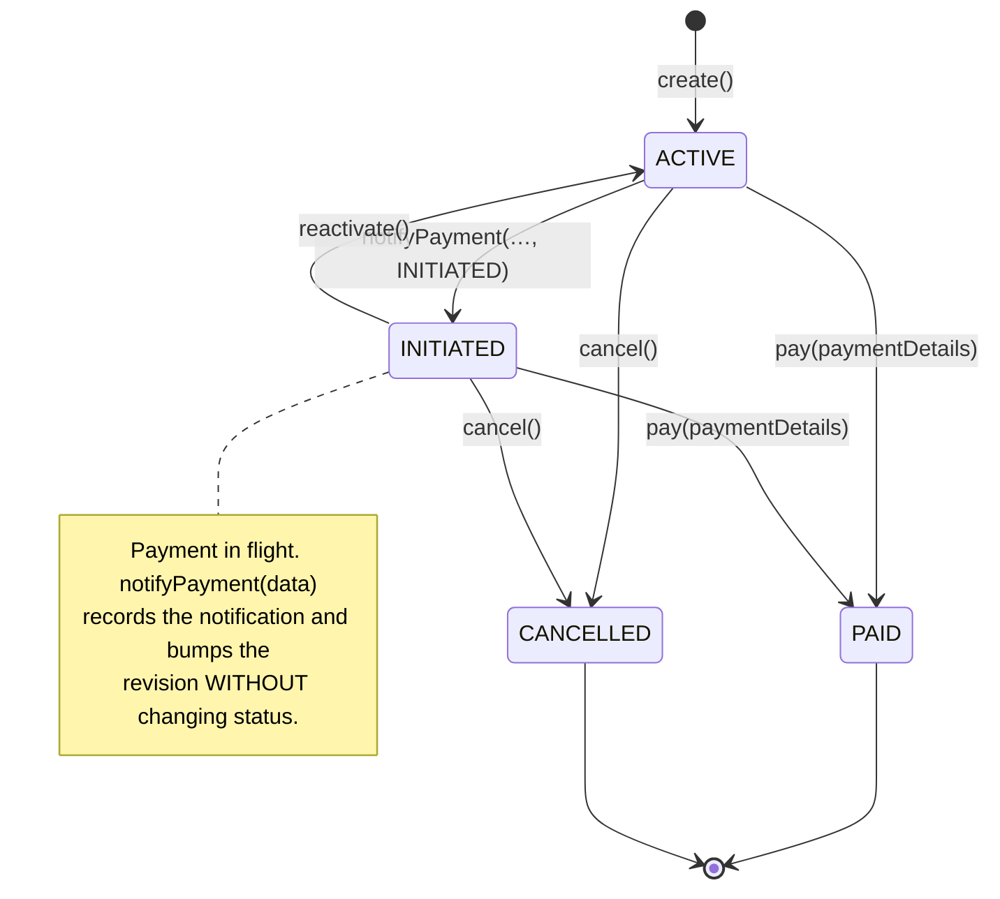
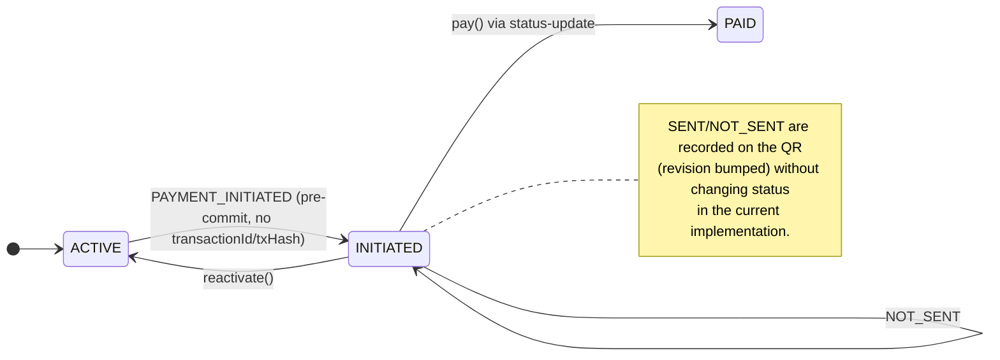

# QR Code State Machine

The lifecycle of a QR Code (payment payload) is modeled by `QRCodeStatusEnum`
(`ACTIVE`, `INITIATED`, `PAID`, `CANCELLED`) and the transition methods on
`QRCodeEntity` (`pay`, `cancel`, `reactivate`, `notifyPayment`), guarded by
`QRCodeEntityValidator`.

## States

| State | Meaning | Terminal |
|-------|---------|----------|
| **ACTIVE** | Created and available for payment (initial state). | No |
| **INITIATED** | A payment is in flight — announced/initiated but not yet settled. | No |
| **PAID** | Payment settled. | **Yes** |
| **CANCELLED** | Payload cancelled by the biller. | **Yes** |

## Core lifecycle

### Transition rules (guards)

| Transition | Method | Allowed from | Notes |
|-----------|--------|--------------|-------|
| create → ACTIVE | `create()` | — | Factory; initial status is always ACTIVE |
| → PAID | `pay(paymentDetails)` | ACTIVE, INITIATED | `paymentDetails` **required** |
| → CANCELLED | `cancel(paymentDetails)` | ACTIVE, INITIATED | `paymentDetails` **must be null** |
| → ACTIVE | `reactivate(paymentDetails)` | **INITIATED only** | `paymentDetails` **must be null** |
| record / → INITIATED | `notifyPayment(data[, status])` | see below | Records notification, bumps revision |

`PAID` and `CANCELLED` are terminal — `pay()`, `cancel()` and `notifyPayment()`
all reject a QR Code that is not ACTIVE or INITIATED.

## Payment-notification effects (by network)

`PaymentNotificationQRCodeUseCase` dispatches on `$.payment.network`, and
`QRCodeEntityValidator` enforces the preconditions:

| Network | Precondition | Status effect | `transactionId` |
|---------|--------------|---------------|-----------------|
| **FedNow / RTP** (instant) | QR = ACTIVE | records (status unchanged) | ISO 20022 End-to-End ID |
| **ACH** | QR = ACTIVE; payer info + expectedDate present; no blockchain data | ACTIVE → **INITIATED** | optional |
| **Blockchain** (Polygon/Solana/Ethereum/Bitcoin) | QR supports a crypto network; blockchain data present | see below | see below |

> FedNow / RTP note: the payment notification is **not required for reconciliation**
> on these rails — the QR Code ID travels inside the ISO 20022 payment message
> itself, so the Payee's PSP can reconcile directly from that message. When a
> notification *is* sent for FedNow/RTP it is essentially a **courtesy** and/or a
> way to convey **segregation between the principal amount and the tip** (see
> `$.payment.amount` vs `$.payment.tipAmount`).

> Settlement note: reaching **PAID** today happens through the biller lifecycle
> endpoint `PUT /api/v1/payment-request/{id}/status-update` (`pay()`). A payment
> notification on its own moves a QR to `INITIATED` (ACH, blockchain pre-commit)
> or records details without changing status; whether a blockchain post-commit
> (`SENT`) notification should auto-transition `INITIATED → PAID` is under review.

## Blockchain: pre-commit vs post-commit

For blockchain networks the notification's `blockchain.action` distinguishes the
on-chain stage, and this maps directly to whether a transaction reference exists:

- **Pre-commit** = **no txHash yet**. `action = PAYMENT_INITIATED`. The transaction
  has not been committed to the chain, so there is no transaction hash. Requires the
  QR to be `ACTIVE`; moves it to `INITIATED`.
- **Post-commit** = **txHash present**. `action = SENT`. The transaction has been
  committed to the chain and therefore has a transaction hash. Requires the QR to be
  `INITIATED`, and the transaction hash **must** be supplied.
- `action = NOT_SENT` — the payment did not proceed; requires the QR to be `INITIATED`.

### ⚠️ Where the txHash goes

There is **no dedicated `txHash` field**. For blockchains, the on-chain
**transaction hash is carried in the network-agnostic `$.payment.transactionId`
field** (ANSI X9.150-2026 §2.5, "Payment Transaction ID"). The same field carries
the ISO 20022 End-to-End ID for FedNow/RTP and the Trace Number for ACH.

So the pre/post-commit rule, stated precisely:

> **Blockchain pre-commit** ⇔ `$.payment.transactionId` is absent (`action = PAYMENT_INITIATED`).
> **Blockchain post-commit** ⇔ `$.payment.transactionId` is present (`action = SENT`) — this is the txHash.

## Source references

- States: `x9-qrcode-domain/.../vo/enumerated/QRCodeStatusEnum.java`
- Transitions: `x9-qrcode-domain/.../entity/QRCodeEntity.java` (`pay`, `cancel`, `reactivate`, `notifyPayment`)
- Guards: `x9-qrcode-domain/.../entity/validator/QRCodeEntityValidator.java`
- Notification dispatch: `x9-qrcode-application/.../usecase/paymentnotification/PaymentNotificationQRCodeUseCase.java`
- Transaction ID field: ANSI X9.150-2026 §2.5

---

Copyright © 2026 Matera Systems, Inc. Licensed under the Matera Source License v1.0 (source-available; not open source) — see LICENSE.md at the repository root. Creating a Derivative Work from this document — by AI/ML generation or by manual re-implementation based on it — is governed by that license (see the "Derivative Work" definition and Annex A).
