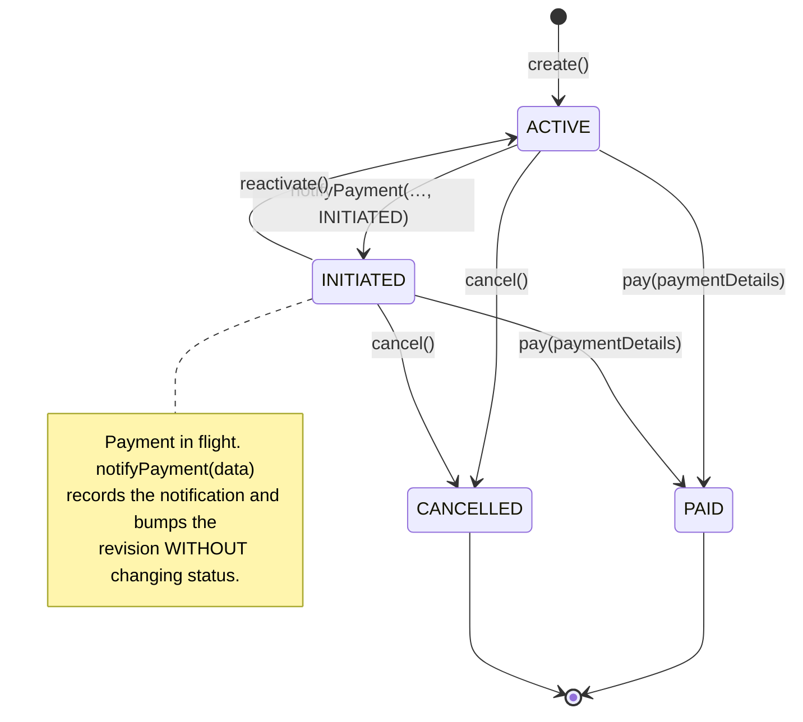
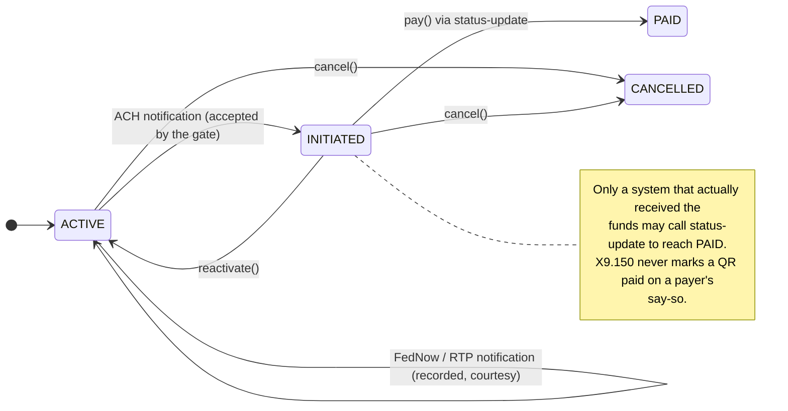

# QR Code State Machine

The lifecycle of a QR Code (payment payload) is modeled by `QRCodeStatusEnum`
(`ACTIVE`, `INITIATED`, `PAID`, `CANCELLED`) and the transition methods on
`QRCodeEntity` (`pay`, `cancel`, `reactivate`, `notifyPayment`), guarded by
`QRCodeEntityValidator`.

## States

| State | Meaning | Terminal |
|-------|---------|----------|
| **ACTIVE** | Created and available for payment (initial state). | No |
| **INITIATED** | A payment is in flight — announced/initiated but not yet settled. | No |
| **PAID** | Payment settled. | **Yes** |
| **CANCELLED** | Payload cancelled by the biller. | **Yes** |

### INITIATED is held against a clock

An `INITIATED` QR Code carries the instant its reservation stops counting
(`x9.reservation.ttl-seconds`, 90 by default). **Past that instant it reads as
`ACTIVE` again** — a payer who announced and then vanished cannot lock a bill until
`validUntil`, which could be days away for a code held for seconds.

Nothing sweeps. The stored status keeps saying what was last *reported*, and the
lapse is applied when somebody looks, so a reservation expiring at 3am wakes nobody
and writes nothing ([ADR-0019](docs/adr/0019-a-reservation-expires-and-nothing-sweeps.md)).

Two consequences that are easy to miss:

- **Expiry is not a status.** A QR Code past its `validUntil` is still `ACTIVE`;
  nothing happened to it, time simply passed. What expiry governs is what *payers*
  may do ([ADR-0020](docs/adr/0020-the-payee-states-the-outcome-of-its-own-receivable.md)).
- **The lapse does not revoke the right to report.** The party that announced may
  still send `SENT` afterwards: the money moved, and the window exists to stop a
  vanished payer locking a bill, not to decide what is true about money.

## Core lifecycle

```mermaid
stateDiagram-v2
    [*] --> ACTIVE : create()

    ACTIVE --> INITIATED : notifyPayment(…, INITIATED)
    INITIATED --> ACTIVE : reactivate()

    ACTIVE --> PAID : pay(paymentDetails)
    INITIATED --> PAID : pay(paymentDetails)

    ACTIVE --> CANCELLED : cancel()
    INITIATED --> CANCELLED : cancel()

    PAID --> [*]
    CANCELLED --> [*]

    note right of INITIATED
        Payment in flight. notifyPayment(data)
        records the notification and bumps the
        revision WITHOUT changing status.
    end note
```

### Transition rules (guards)

| Transition | Method | Allowed from | Notes |
|-----------|--------|--------------|-------|
| create → ACTIVE | `create()` | — | Factory; initial status is always ACTIVE |
| → PAID | `pay(paymentDetails)` | ACTIVE, INITIATED | `paymentDetails` **required** |
| → CANCELLED | `cancel(paymentDetails)` | ACTIVE, INITIATED | `paymentDetails` **must be null** |
| → ACTIVE | `reactivate(paymentDetails)` | **INITIATED only** | `paymentDetails` **must be null** |
| record / → INITIATED | `notifyPayment(data[, status])` | see below | Records notification, bumps revision |

`PAID` and `CANCELLED` are terminal — `pay()`, `cancel()` and `notifyPayment()`
all reject a QR Code that is not ACTIVE or INITIATED.

## Payment-notification effects (by network)

`PaymentNotificationQRCodeUseCase` dispatches on `$.payment.network`, and
`QRCodeEntityValidator` enforces the preconditions:

| Network | Precondition | Status effect | `transactionId` |
|---------|--------------|---------------|-----------------|
| **FedNow / RTP** (instant) | QR = ACTIVE | records (status unchanged) | ISO 20022 End-to-End ID |
| **ACH** | QR = ACTIVE; payer info + expectedDate present | ACTIVE → **INITIATED** (goes through the acceptance gate) | Trace Number, optional |
| Anything else | — | **refused at creation**, so no notification can name it ([ADR-0012](docs/adr/0012-refuse-what-this-deployment-cannot-honour.md)) | — |

> FedNow / RTP note: the payment notification is **not required for reconciliation**
> on these rails — the QR Code ID travels inside the ISO 20022 payment message
> itself, so the Payee's PSP can reconcile directly from that message. When a
> notification *is* sent for FedNow/RTP it is essentially a **courtesy** and/or a
> way to convey **segregation between the principal amount and the tip** (see
> `$.payment.amount` vs `$.payment.tipAmount`).

> **Settlement note — answered: a post-commit notification never marks a QR paid.**
> X9.150 does not touch money and cannot observe settlement; it only knows what a
> payer *claimed*. So a `SENT` notification carrying a transaction hash publishes
> `payment.sent` and leaves the QR at `PAYMENT_INITIATED`.
>
> Reaching **PAID** requires a system that actually received the funds: it matches
> the reported transaction against what arrived and calls
> `PUT /api/v1/payment-request/{id}/status-update`, which is what emits
> `payment.cleared`. Auto-clearing on a payer's say-so would let a payer mark a QR
> paid by asserting a transaction — the QR's own defence against double payment
> would then rest on the word of the party it is defending against.

## Pre-commit vs post-commit — live on Solana, dormant on the bank rails

A notification can arrive at two moments: before the money moves, and after. The
first is a **request for permission** and goes through the acceptance gate; the
second merely **reports** what already happened.

Distinguishing them needs evidence, and the evidence is a transaction reference:

> **Pre-commit** ⇔ `$.payment.transactionId` is absent.
> **Post-commit** ⇔ `$.payment.transactionId` is present.

The committee rejected an explicit phase marker, so this inference is the only
mechanism available ([ADR-0004](docs/adr/0004-phase-inferred-from-transaction-id.md)).

**Solana exercises the post-commit half; the bank rails do not.** It reports a
transaction already committed to a public ledger — a distinction only a blockchain
offers, because the payer can point at a txHash anyone can verify. An ACH debit has
no evidenced moment between "announced" and "settled" that the payer could produce.
So on `fednow`, `rtp` and `ach` the two-phase dispatch stays in place and
`payment.sent` and `payment.failed` are never emitted; on `solana` both fire:

| `blockchain.action` | what it means | effect |
|---|---|---|
| `PAYMENT_INITIATED` | about to pay | `ACTIVE` → `PAYMENT_INITIATED`, `payment.initiated` |
| `SENT` | paid, here is the hash | status unchanged, `payment.sent` |
| `NOT_SENT` | not paying after all | `PAYMENT_INITIATED` → `ACTIVE`, `payment.failed` |

`NOT_SENT` is the exception to the "post-commit reports a committed transaction"
rule above, and the exception is the point: its whole meaning is that no transaction
exists and none will. It is the only message by which a payer can give a reserved
bill back, so it is keyed on the **action** rather than on the presence of a
transaction reference — a rule that demanded one of every post-commit notification
refused the one notification that cannot carry one
([ADR-0021](docs/adr/0021-a-reservation-knows-who-holds-it.md)).

**Only the party that announced may send `SENT` or `NOT_SENT`**, and only they may
announce again — identified by `payer.info` paired with the signing certificate's
subject. A repeat from that party refreshes the reservation's window and publishes
nothing; anybody else gets `409`.

### ⚠️ Where a transaction reference goes

There is **no dedicated `txHash` field**. The network-agnostic
`$.payment.transactionId` (ANSI X9.150-2026 §2.5, "Payment Transaction ID") carries
whatever reference the rail uses: the ISO 20022 End-to-End ID for FedNow/RTP, the
Trace Number for ACH, and — when an interpreted chain returns — the on-chain
transaction hash.

```mermaid
stateDiagram-v2
    direction LR
    [*] --> ACTIVE
    ACTIVE --> INITIATED : ACH notification (accepted by the gate)
    ACTIVE --> ACTIVE : FedNow / RTP notification (recorded, courtesy)
    INITIATED --> ACTIVE : reactivate()
    INITIATED --> PAID : pay() via status-update
    ACTIVE --> CANCELLED : cancel()
    INITIATED --> CANCELLED : cancel()

    note right of INITIATED
        Only a system that actually received the
        funds may call status-update to reach PAID.
        X9.150 never marks a QR paid on a payer's
        say-so.
    end note
```

## Source references

- States: `x9-qrcode-domain/.../vo/enumerated/QRCodeStatusEnum.java`
- Transitions: `x9-qrcode-domain/.../entity/QRCodeEntity.java` (`pay`, `cancel`, `reactivate`, `notifyPayment`)
- Guards: `x9-qrcode-domain/.../entity/validator/QRCodeEntityValidator.java`
- Notification dispatch: `x9-qrcode-application/.../usecase/paymentnotification/PaymentNotificationQRCodeUseCase.java`
- Transaction ID field: ANSI X9.150-2026 §2.5

---

Copyright © 2026 Matera Systems, Inc. Licensed under the Matera Source License v1.0 (source-available; not open source) — see LICENSE.md at the repository root. Creating a Derivative Work from this document — by AI/ML generation or by manual re-implementation based on it — is governed by that license (see the "Derivative Work" definition and Annex A).
